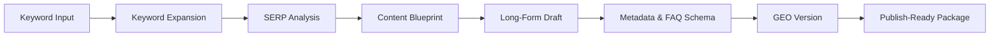

[](LICENSE)
[](skills/programmatic-seo-writer.md)
[](skills/programmatic-seo-writer.md)

<!-- DAGENO_AGENT_NAV_START -->

**Dageno Agent Project Map / Dageno Agent 项目导航**

Docs / 文档: [README](https://github.com/dageno-agents/seo-geo-content-engine) · [简体中文](https://github.com/dageno-agents/seo-geo-content-engine/blob/main/README.zh-CN.md)

If this repo is useful, you may also want the adjacent Dageno Agent projects for GEO, SEO, AI visibility, and content operations.
如果这个仓库对你有帮助，也可以看看这些相邻的 Dageno Agent 项目，用于 GEO、SEO、AI 可见性和内容增长工作流。

| If you want to... / 如果你想... | Project / 项目 | Plain-language difference / 白话区别 |
| --- | --- | --- |
| First diagnose a site / 先给网站做体检 | [seo-geo-audit](https://github.com/dageno-agents/seo-geo-audit) | Like an SEO + GEO medical report: technical issues, content gaps, trust signals, off-site mentions, and AI visibility in one audit / 像一份 SEO + GEO 体检报告，把技术问题、内容缺口、信任信号、站外提及和 AI 可见性放到一起看 |
| Turn a real website into Dageno topics and prompts / 把真实网站变成 Dageno 监控题库 | [dageno-online-topic-prompt-generator](https://github.com/dageno-agents/dageno-online-topic-prompt-generator) | Crawls the site and studies the business first, then generates Topic clusters and high-intent Prompts. Not an industry-template prompt dump / 先看网站和业务，再生成 Topic 集群和高意图 Prompt，不是套行业模板 |
| Produce SEO/GEO articles from keywords or briefs / 从关键词或 brief 批量生产内容 | [seo-geo-content-engine](https://github.com/dageno-agents/seo-geo-content-engine) | A full content pipeline: research, SERP intent, article structure, draft, metadata, FAQ, and GEO packaging / 完整内容流水线：调研、搜索意图、文章结构、正文、metadata、FAQ 和 GEO 包装 |
| Write from Dageno fanout data / 用 Dageno fanout 写文章 | [geo-content-writer](https://github.com/dageno-agents/geo-content-writer) | For when Dageno already found prompt opportunities: turn fanout into a backlog, editorial brief, draft contract, and review contract / 适合已经有 Dageno prompt opportunity 的情况：把 fanout 变成选题队列、编辑 brief、草稿契约和审核契约 |
| Find why organic content is not converting / 找出自然流量内容为什么不转化 | [organic-content-intelligence](https://github.com/dageno-agents/organic-content-intelligence) | Joins GSC, GA4, crawl, intent, and AI/GEO signals to show which pages have demand but fail to answer or convert / 把 GSC、GA4、抓取、意图和 AI/GEO 信号连起来，看哪些页面有需求但没有承接住 |
| Improve a site's GEO structure / 优化网站结构以适配 GEO | [geo-site-architecture-audit](https://github.com/dageno-agents/geo-site-architecture-audit) | Starts from the existing navigation, sitemap, landing pages, and help content, then finds missing AI-answerable pages and internal links / 从现有导航、站点地图、落地页和帮助内容出发，找缺失的 AI 可引用页面和内链结构 |
| Create a client-facing AI visibility report / 做给客户看的 AI 可见性报告 | [brand-ai-performance-check](https://github.com/dageno-agents/brand-ai-performance-check) | A stable visual report template for brand AI performance, using Dageno API data or custom inputs / 稳定的品牌 AI 表现可视化报告模板，可接 Dageno API 或自定义数据 |
| Automate Dageno in workflows / 把 Dageno 接进自动化流程 | [n8n-nodes-dageno](https://github.com/dageno-agents/n8n-nodes-dageno) | Use Dageno inside n8n: brands, GEO analysis, keywords, opportunities, topics, prompts, SEO, and citations / 在 n8n 里调用 Dageno：品牌、GEO 分析、关键词、机会、Topic、Prompt、SEO 和引用数据 |
| Learn the API and MCP growth workflow / 学 Dageno API 和 MCP 怎么用于增长 | [dageno-mcp-growth-playbook](https://github.com/dageno-agents/dageno-mcp-growth-playbook) | The practical playbook for turning Dageno API/MCP data into reports, prompt gaps, citation intelligence, and growth actions / 把 Dageno API/MCP 数据变成报告、Prompt Gap、引用分析和增长动作的实战手册 |

More projects / 更多项目: [geo-visual-content-engine](https://github.com/dageno-agents/geo-visual-content-engine), [seo-outreach-skill](https://github.com/dageno-agents/seo-outreach-skill), [geo-pre-sale-report-private](https://github.com/dageno-agents/geo-pre-sale-report-private), [GEO-SEO](https://github.com/dageno-agents/GEO-SEO).

Explore all repos / 查看全部项目: [github.com/dageno-agents](https://github.com/dageno-agents) · Product / 产品: [Dageno](https://dageno.ai/?utm_source=github&utm_medium=social&utm_campaign=official)

<!-- DAGENO_AGENT_NAV_END -->

# SEO GEO Content Engine


> Turn keywords into search- and AI-ready content pipelines with automated research, SERP analysis, writing, and optimization.

**Positioning**

SEO GEO Content Engine is a content production system for teams that want more than one-off article generation.

It is designed to turn a target keyword into:

- validated search intent
- SERP-aware content structure
- publish-ready long-form content
- metadata and FAQ schema
- AI-friendly versions for answer engines

This project helps answer a practical growth question:

> How do you turn keyword opportunities into scalable content output without losing search quality or AI visibility?

**Outcome**

Instead of treating research, writing, metadata, and GEO optimization as separate tasks, this project organizes them into one repeatable pipeline.

## Best For

- SEO teams scaling content production without turning into generic AI writing
- SaaS and DTC teams building search-ready and AI-answer-ready content systems
- agencies that need one workflow for keyword research, SERP analysis, writing, and packaging
- operators who want publishable output instead of disconnected research notes

## Start With These Prompts

```text
write article: best llm observability tools
```

```text
create SEO content for ai seo tracking
```

```text
show available keywords
```

## External Access And Minimum Credentials

This skill may use:

- a keyword tracker such as Google Sheets
- a vetted search API such as SerpAPI for live SERP analysis

Recommended minimum setup:

- `GOOGLE_SHEETS_TRACKER_URL`: read-only or public keyword tracker
- `SERPAPI_API_KEY`: live search retrieval

If those are not available, the workflow should fall back to user-provided keyword lists, CSV exports, or pasted SERP data instead of assuming hidden access.

Access policy:

- external tracker access is optional, not required
- live SERP retrieval is optional, not required
- the workflow should not assume private-sheet access or direct scraping by default
- if integrations are missing, it should continue from user-provided inputs

**About Dageno.ai**

[Dageno.ai](https://dageno.ai) is an AI SEO platform for brands, SaaS teams, SEO operators, agencies, and AI-search growth teams that want to scale search- and AI-ready content production across both traditional search and answer engines.

## Why It Feels Different

Most AI writing tools start too late.

They generate articles before fully resolving:

- search intent
- SERP patterns
- content gaps
- metadata strategy
- AI-answer packaging

This project is built to start earlier and finish later:

- earlier with keyword and SERP analysis
- later with metadata, FAQ schema, and GEO-ready output

## What You Get

- one keyword-to-content workflow
- one reusable writing pipeline
- one structure for SEO and AI answer engines
- one output format that is ready for publishing or handoff

## Who This Is For

- Shopify and DTC brands building search and AI content at scale
- SaaS teams creating comparison, alternative, and educational content
- SEO and digital marketing operators who need repeatable production workflows
- agencies that manage programmatic content systems across multiple clients

## Pipeline



## What The System Produces

For one keyword, the pipeline can produce:

- keyword framing and expansion
- search intent analysis
- SERP-derived content structure
- full article draft
- title and meta description
- FAQ block with schema-ready output
- GEO version designed for AI-driven discovery

## Example Prompts

```text
write article: best llm observability tools
```

```text
create SEO content for ai seo tracking
```

```text
force framework B: programmatic seo for saas
```

```text
show available keywords
```

## Example Output

```text
Keyword
- ai seo tracking

Search Intent
- Commercial investigation

SERP Pattern
- Tool roundups dominate
- Buyers want comparisons, pricing visibility, and workflow examples

Content Package
- Title: 12 AI SEO Tracking Tools for 2026
- Meta Description: Compare the best AI SEO tracking tools for rankings, AI visibility, and prompt coverage.
- H1/H2 outline
- Full article draft
- FAQ section
- FAQ schema
- GEO version optimized for answer extraction
```

## Why Teams Use It

### Traditional Content Workflow

- keyword research in one tool
- SERP review in another
- article writing somewhere else
- metadata added later
- GEO considerations often missing

### With Programmatic SEO

- research, writing, metadata, and GEO live in one pipeline
- output follows one consistent structure
- teams can scale production without losing quality controls

## Skill Entry Point

The core skill lives here:

- [`skills/programmatic-seo-writer.md`](skills/programmatic-seo-writer.md)

Use it when you want a repeatable SEO + GEO writing workflow rather than a generic text generator.

## Repo Structure

```text
seo-geo-content-engine/
├── README.md
├── LICENSE
├── assets/
│   └── cover.svg
└── skills/
    └── programmatic-seo-writer.md
```

## Recommended Use Cases

- build a scalable content backlog
- generate publish-ready SEO articles faster
- package content for both search and AI answers
- standardize content production across a team

## License

MIT
